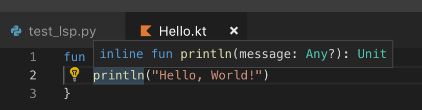

Run the test with `pytest -s`


I am expecting some kind of response in JSON format containing one or more strings with `inline fun println(message: Any?): Unit`. That would correspond to the text that is displayed when hovering over line two column nine in [](./Hello.kt)



However, it seems as if the Kotlin LSP does not return anything. The test in [](./test_lsp.py) keeps on hanging reading from stdout of the Kotlin LSP after sending the following message:


```
b'Content-Length: 215\r\n\r\n{"jsonrpc": "2.0", "id": 1, "method": "textDocument/hover", "params": {"textDocument": {"uri": "file:///Users/bumm/Documents/documents/python/kotlin_kernel/tests/Hello.kt"}, "position": {"line": 2, "character": 9}}}'
```


